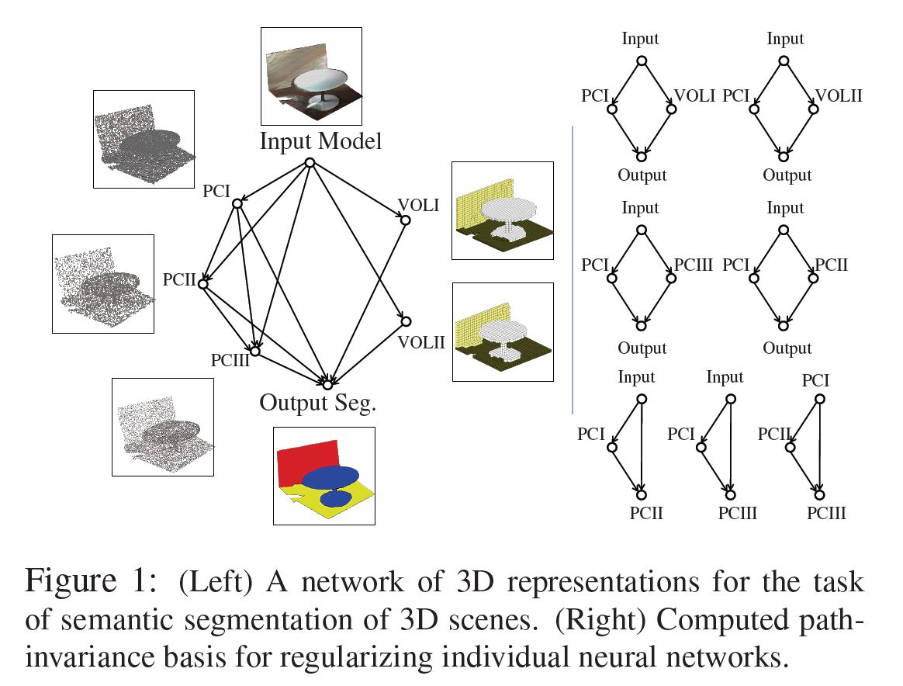
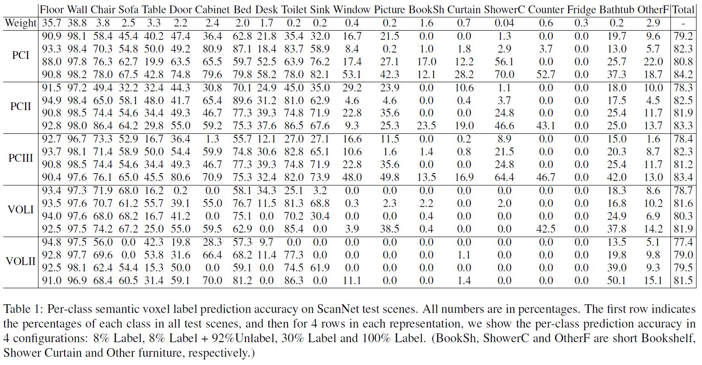

# Path Invariance Network in Tensorflow

Tensorflow implementation of one application in [Path Invariance Map Networks](https://arxiv.org/abs/1812.11647): 3D Semantic Segmentation.
Since we use [pointnet2](https://github.com/charlesq34/pointnet2) codebase, some of the code are borrowed from there.

## Prerequisites

- Two GPUs(GTX 1080 or better)
- Python 2.7 
- [Tensorflow 0.12.1](https://github.com/tensorflow/tensorflow/tree/r0.12)
- [SciPy](http://www.scipy.org/install.html)
- [Pointnet2 Customized TF Operators](https://github.com/charlesq34/pointnet2/tree/master/tf_ops) Please make sure the tf_ops folder is placed in the same directory.

## Usage

First, download dataset [here](https://drive.google.com/open?id=1tOFn5rcs-9KsmfBOO9au3jeJiGTX7ikn). (Point clouds are collected by Pointnet++)
The pre-trained models can be downloaded [here](https://drive.google.com/open?id=1hZYRfFNsx9b0KMI5YwX_ZmbKRRQJto-Z).
(Point clouds models are trained using Pointnet++, and voxel models are trained using 3D-U-Net. The training code for voxel models will be released soon.)

To train models with downloaded dataset:

    $ ./cmd

All training commands are included in the cmd file.
Testing results are logged during the training stage.

## Results

## Author

Zaiwei Zhang

## License
Our code is released under BSD License (see LICENSE file for details).
